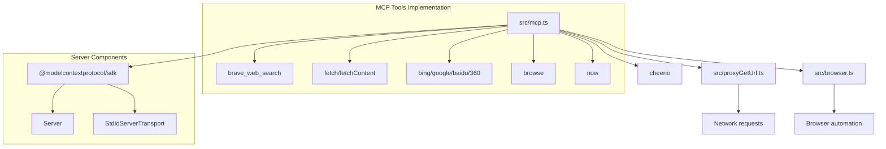

<think>Let me analyze the code structure and identify the MCP (Model Context Protocol) tools implemented in the project. The code seems to be a Node.js application that implements a server following the MCP protocol.

First, let's identify the key components and structure of the code:

1. Imports and dependencies:
   - MCP SDK components like Server, StdioServerTransport
   - Cheerio for HTML parsing
   - Custom modules like proxyGetUrl and browser

2. Type definitions:
   - BraveWeb interface for Brave search API responses
   - Type guard functions like isBraveWebSearchArgs

3. Tool definitions - each tool is defined as an object with:
   - name
   - description 
   - inputSchema (properties, required fields)

4. Server setup and environment configuration:
   - Creating a new Server instance
   - Checking for required API keys
   - Setting up rate limiting

5. Implementation functions for each tool:
   - Functions like performWebSearch, fetchHTML, extractContent, etc.
   - Each function implements the behavior of a specific tool

6. MCP request handlers:
   - ListToolsRequestSchema handler that returns available tools
   - CallToolRequestSchema handler that executes tool calls

7. Server startup function

Now, let's list all the MCP tools implemented in the project:

1. brave_web_search (WEB_SEARCH_TOOL): Executes Brave Web search for broad information queries with pagination support
2. fetch (HTML_FETCH_TOOL): Gets the raw HTML content of a target webpage
3. fetchContent (CONTENT_EXTRACT_TOOL): Extracts the main content from a webpage, removing HTML tags and excess whitespace
4. bing (BING_SEARCH_TOOL): Uses Bing search engine to get web search results
5. google (GOOGLE_SEARCH_TOOL): Uses Google search engine to get web search results (requires proxy support)
6. browse (BROWSE_TOOL): Uses a browser approach to get web content, supporting dynamically rendered pages
7. baidu (BAIDU_SEARCH_TOOL): Uses Baidu search engine to get web search results
8. 360 (SO_SEARCH_TOOL): Uses 360 search engine to get web search results
9. now (NOW_TOOL): Gets the current time, returning a formatted date-time string with UTC timezone offset support

Each of these tools is registered with the server and can be called by clients of the MCP server. The server handles requests to list available tools and to call specific tools with arguments.

The code also includes rate limiting logic to prevent overuse of the APIs, and error handling to provide appropriate responses when tool calls fail.</think># MCP 工具项目分析

这个项目是一个基于 Model Context Protocol (MCP) 的工具服务，主要提供网络搜索、内容获取和页面解析功能。让我对代码结构和实现的工具进行分析。

## 项目结构

项目是一个 Node.js 应用程序，使用 TypeScript 开发，主要构成包括：

1. **MCP Server 实现**：使用 `@modelcontextprotocol/sdk` 创建服务器实例
2. **网络请求模块**：用于执行各种网络请求和内容获取
3. **内容解析模块**：使用 cheerio 进行 HTML 解析
4. **浏览器自动化**：通过 browser 模块支持动态网页渲染
5. **工具定义和处理**：定义各种工具及其处理逻辑
6. **速率限制**：实现了简单的请求速率限制

## 已实现的 MCP 工具

项目实现了以下 9 个 MCP 工具：

1. **brave_web_search**
   - 功能：执行 Brave Web 搜索
   - 参数：query（搜索关键词）、count（结果数量）、offset（分页偏移量）
   - 需要：Brave API 密钥

2. **fetch**
   - 功能：获取网页原始 HTML 内容
   - 参数：url（目标网页 URL）、timeout（超时时间，默认 5000ms）

3. **fetchContent**
   - 功能：提取网页正文内容，自动去除 HTML 标签和多余空白
   - 参数：url（目标网页 URL）、selector（CSS 选择器，默认为 body）

4. **bing**
   - 功能：使用 Bing 搜索引擎获取搜索结果
   - 参数：query（搜索关键词）、count（结果数量，默认 10）

5. **google**
   - 功能：使用 Google 搜索引擎获取搜索结果
   - 参数：query（搜索关键词）、count（结果数量，默认 10）
   - 特点：需要代理支持，使用浏览器模拟

6. **browse**
   - 功能：使用浏览器方式获取网页内容，支持动态渲染页面
   - 参数：url（目标网页 URL）、timeout（超时时间，默认 30000ms）

7. **baidu**
   - 功能：使用百度搜索引擎获取搜索结果
   - 参数：query（搜索关键词）、count（结果数量，默认 10）

8. **360**
   - 功能：使用 360 搜索引擎获取搜索结果
   - 参数：query（搜索关键词）、count（结果数量，默认 10）

9. **now**
   - 功能：获取当前时间，返回格式化的日期时间字符串
   - 参数：offset（UTC 时区偏移值，默认为 8）

## 技术特点

1. 使用 MCP SDK 提供标准化的工具接口
2. 采用 cheerio 进行网页内容解析
3. 支持多种搜索引擎（Brave、Bing、Google、百度、360）
4. 实现速率限制以防止 API 过度使用
5. 使用浏览器自动化技术支持动态页面内容获取
6. 通过 StdioServerTransport 提供标准输入/输出通信

项目设计模式清晰，每个工具都有明确的输入模式定义和对应的处理函数，便于扩展和维护。

## 项目文件关系图

### 文件关系说明

1. **src/mcp.ts**
   - 主入口文件
   - 实现 MCP 服务器和工具处理程序
   - 导入并使用其他文件的功能

2. **src/proxyGetUrl.ts**
   - 提供 HTTP 请求功能
   - 被 mcp.ts 用于向外部 API 发出网络请求
   - 可能处理代理配置和错误处理

3. **src/browser.ts**
   - 提供浏览器自动化功能
   - 用于需要渲染 JavaScript 的工具（Google、百度、360搜索、browse）
   - 可能使用无头浏览器实现

### 数据流

1. MCP 服务器接收工具调用请求
2. 根据工具名称，将请求分派到相应的处理函数
3. 处理函数使用：
   - 通过 proxyGetUrl 进行简单内容获取的直接 HTTP 请求
   - 通过 browser.js 进行需要 JavaScript 渲染的动态内容的浏览器自动化
4. 解析结果并返回给调用者
